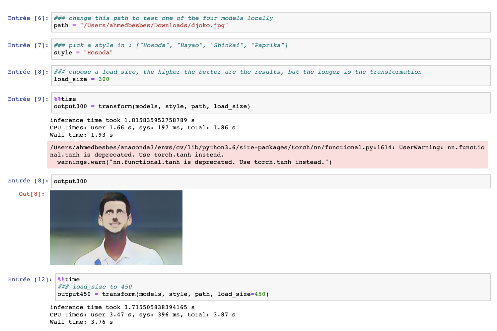
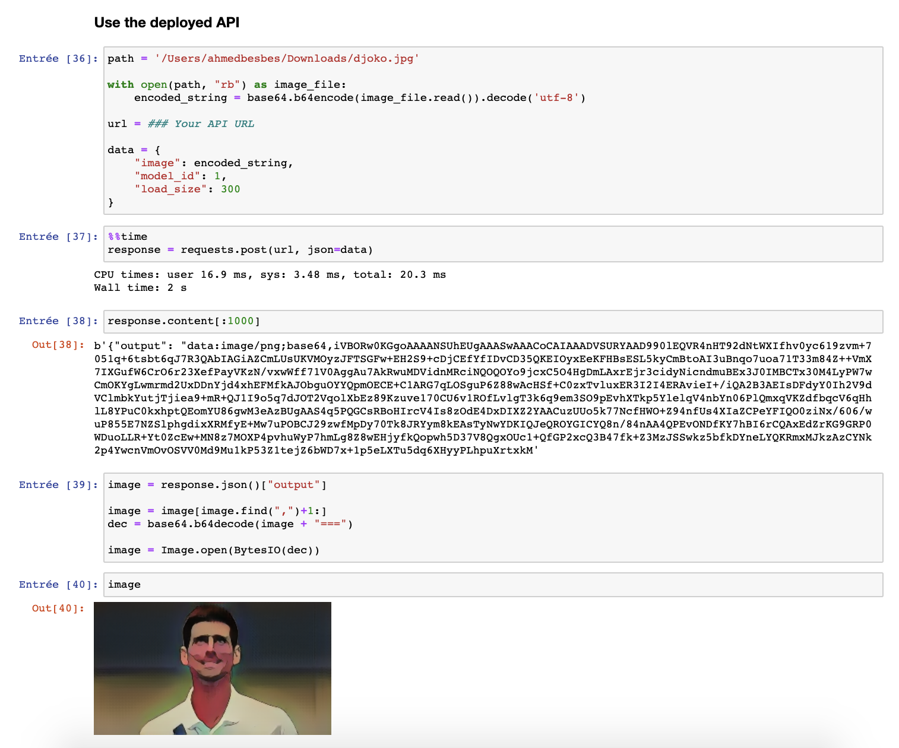

# Build and Deploy Cartoonify: a Serverless Machine Learning App

This repo contains all the code needed to run, build and deploy Cartoonify: a toy app I made from scratch to turn your pictures into cartoons.

<p align="center">
  
</p>

**Here's what motivated me in starting this project:**

- Give GANs a try. I've been fascinated by these models lately. Trying the CartoonGAN model to turn your face into a cartoon seemed like real fun

- Learn about deploying an application on a serverless architecture using different services of AWS (Lambda, API Gateway, S3, etc.)

- Practice my React skills. I was so damn bored of Plotly, Dash and Streamlit. I wanted, for once, to build something custom and less mainstream

- Use Netlify to deploy this React app. I saw demos of how easy this process was and I wanted to try it to convince myself

# 0. Some prerequisites to build and deploy Cartoonify 🛠

If you want to run and deploy Cartoonify, here are some prerequisites first:

- An AWS account (don't worry, deploying this app will cost you almost **nothing**)
- A free account on Netlify
- Docker installed on your machine
- node and npm (preferably the latest versions) installed on your machine
- torch and torchvision to test CartoonGAN locally (optional)

All set? you're now ready to go.

### Testing cartoonGAN on Google colab

check out `cartoongan/notebooks/standalone_cartoonify.ipynb`

or online on [Colab](https://colab.research.google.com/drive/1Lq8mACJKP8TBxY-TJcsdyo_qul-OVdYc#scrollTo=ug2o6M2IqyAu)

Please follow these four steps:

# 1. Test CartoonGAN locally

Some parts of the CartoonGan code as well as the pretrained models are borrowed from this [repo](https://github.com/Yijunmaverick/CartoonGAN-Test-Pytorch-Torch). A shout out to them for the great work!

This is more of an exploratory step where you get to play with the pretrained models and try them (**so inference only**) on some sample images.

If you're interested in the training procedure, have a look at the CartoonGAN [paper](https://openaccess.thecvf.com/content_cvpr_2018/papers/Chen_CartoonGAN_Generative_Adversarial_CVPR_2018_paper.pdf)

- Download the four pretrained models first. These weights will be loaded inside the Generator model defined in **`cartoongan/network/Transformer.py`**

```bash
cd cartoongan
bash download_pth.sh
```

- To test one of the four models, head over the notebook **`cartoongan/notebooks/CartoonGAN.ipynb`** and change the input image path to your test image.
  This notebook calls **`cartoongan/test_from_code.py`** script to make the transformation.

```bash
cd cartoongan/notebooks
jupyter notebook
```



# 2. Deploy CartoonGAN on a serverless API using AWS Lambda

The goal of this section is to deploy the CartoonGAN model on a serverless architecture so that it can be requested through an API endpoint ... from the internet :computer:

## Why does a serverless architecture matter?

In a serverless architecture using Lambda functions, for example, you don't have to provision servers yourself. Roughly speaking, you only write the code that'll be execuded and list its dependencies and AWS will manage the servers for you automatically and take care of the infrastructure.

This has a lot of benefits:

1. Cost efficiency: you don't have to pay for a serverless architecture when you don't use it. On the opposite, when you have an EC2 machine running and not processing any request, you still pay for it.

2. Scalability: if a serverless application starts having a lot of requests at the same time, AWS will scale it by allocating more power to manage the load. If you had the manage the load by yourself using EC2 instances, you would do this by manually allocating more machines and creating a load balancer.

Of course, Serverless architectures cannot be a perfect fit for any use-case. In some situations, they are not practical at all (need for real-time or quick responses, use of WebSocket, heavy processing, etc.).

Since I frequently build machine learning models and integrate them into web applications, I found that a serverless architecture was interesting in these specific use-cases. Of course, here the models are used in **inference only** :warning:

## Cartoonify workflow

Here's the architecture of the app:

<p align="center">
 
</p>

- On the right side, we have a frontend interface in React and on the left side, we have a backend deployed on a serverless AWS architecture.
- The backend and the frontend communicate with each other over HTTP requests. Here is the workflow:

  - An image is sent from the client through a POST request
  - The image is then received via API Gateway
  - API Gateway triggers a Lambda function to execute and passes the image to it
  - The Lambda function starts running: it first fetches the pretrained models from S3 and then applies the style transformation on it
  - Once the Lambda function is done running, it sends the transformed image back to the client through API Gateway.

## Deploy using the Serverless framework

We are going to define and deploy this architecture by writing it as a Yaml file using the [Serverless](https://www.serverless.com/) framework: an open-source tool to automate deployment to AWS, Azure, Google Cloud, etc.

<p align="center">
  
</p>

Here are the steps to follow:

1.  Install the serverless framework on your machine

```bash
npm install -g serverless
```

2.  Create an IAM user on AWS with administrator access and name it **cartoonify**.
    Then configure serverless with this user's credentials:

```bash
serverless config credentials --provider aws \
                              --key <ACCESS_KEY> \
                              --secret <SECRET_KEY> \
                              --profile cartoonify
```

3.  bootstrap a serverless project with a python template at the root of this project

```bash
serverless create --template aws-python --path backend
```

From now on, you can either follow the steps from 4 to 10 to understand what happens, or run the code you just cloned to deploy the app.

_If you're in hurry, just run these two commands:_

```bash
cd backend/
npm install
sls deploy
```

4.  install two Serverless plugins:

```bash
sls plugin install -n serverless-python-requirements
npm install --save-dev serverless-plugin-warmup
```

5.  Create a folder called `network` inside `backend` and put the following two files in it:

    - Transformer.py: a script that holds the architecture of the generator model.
    - A blank \_\_init\_\_.py

6.  Modify the serverless.yml file with the following sections:

```yaml
# The provider section where we setup the provider, the runtime and the permissions:

provider:
  name: aws
  runtime: python3.7
  profile: cartoonify
  region: eu-west-3
  timeout: 60
  iamRoleStatements:
      - Effect: Allow
      Action:
          - s3:getObject
      Resource: arn:aws:s3:::cartoonify295/models/*
      - Effect: Allow
      Action:
          - "lambda:InvokeFunction"
      Resource: "*"
```

---

```yaml
# The custom section where we configure the plugins:
custom:
  pythonRequirements:
  dockerizePip: true
  zip: true
  slim: true
  strip: false
  noDeploy:
    - docutils
    - jmespath
    - pip
    - python-dateutil
    - setuptools
    - six
    - tensorboard
  useStaticCache: true
  useDownloadCache: true
  cacheLocation: "./cache"
  warmup:
  events:
    - schedule: "rate(5 minutes)"
  timeout: 50
```

---

```yaml
# The package section where we exclude folders from production
package:
  individually: false
  exclude:
    - package.json
    - package-log.json
    - node_modules/**
    - cache/**
    - test/**
    - __pycache__/**
    - .pytest_cache/**
    - model/pytorch_model.bin
    - raw/**
    - .vscode/**
    - .ipynb_checkpoints/**
```

---

```yaml
# The functions section where we create the Lambda function and define the events that invoke it:
functions:
  transformImage:
    handler: src/handler.lambda_handler
    memorySize: 3008
    timeout: 300
    events:
      - http:
          path: transform
          method: post
          cors: true
    warmup: true
```

---

```yaml
# and finally the plugins section:
plugins:
  - serverless-python-requirements
  - serverless-plugin-warmup
```

---

7. List the dependencies inside requirements.txt

```bash
https://download.pytorch.org/whl/cpu/torch-1.1.0-cp37-cp37m-linux_x86_64.whl
https://download.pytorch.org/whl/cpu/torchvision-0.3.0-cp37-cp37m-linux_x86_64.whl
Pillow==6.2.1
```

8. Create an `src` folder inside `backend` and put handler.py in it to define the lambda function. Then modify handler.py

```python
# Define imports
try:
    import unzip_requirements
except ImportError:
    pass

import json
from io import BytesIO
import time
import os
import base64

import boto3
import numpy as np
from PIL import Image

import torch
import torchvision.transforms as transforms
from torch.autograd import Variable
import torchvision.utils as vutils
from network.Transformer import Transformer
```

---

```python
# Define two functions inside handler.py: img_to_base64_str to
# convert binary images to base64 format and load_models to
# load the four pretrained model inside a dictionary and then
# keep them in memory

def img_to_base64_str(img):
    buffered = BytesIO()
    img.save(buffered, format="PNG")
    buffered.seek(0)
    img_byte = buffered.getvalue()
    img_str = "data:image/png;base64," + base64.b64encode(img_byte).decode()
    return img_str


def load_models(s3, bucket):
    styles = ["Hosoda", "Hayao", "Shinkai", "Paprika"]
    models = {}

    for style in styles:
        model = Transformer()
        response = s3.get_object(
            Bucket=bucket, Key=f"models/{style}_net_G_float.pth")
        state = torch.load(BytesIO(response["Body"].read()))
        model.load_state_dict(state)
        model.eval()
        models[style] = model

    return models
```

---

```python
def lambda_handler(event, context):
  """
  lambda handler to execute the image transformation
  """
  # warming up the lambda
  if event.get("source") in ["aws.events", "serverless-plugin-warmup"]:
      print('Lambda is warm!')
      return {}

  # extracting the image form the payload and converting it to PIL format
  data = json.loads(event["body"])
  print("data keys :", data.keys())
  image = data["image"]
  image = image[image.find(",")+1:]
  dec = base64.b64decode(image + "===")
  image = Image.open(BytesIO(dec))
  image = image.convert("RGB")

  # loading the model with the selected style based on the model_id payload
  model_id = int(data["model_id"])
  style = mapping_id_to_style[model_id]
  model = models[style]

  # resize the image based on the load_size payload
  load_size = int(data["load_size"])

  h = image.size[0]
  w = image.size[1]
  ratio = h * 1.0 / w
  if ratio > 1:
      h = load_size
      w = int(h*1.0 / ratio)
  else:
      w = load_size
      h = int(w * ratio)

  image = image.resize((h, w), Image.BICUBIC)
  image = np.asarray(image)

  # convert PIL image from  RGB to BGR
  image = image[:, :, [2, 1, 0]]
  image = transforms.ToTensor()(image).unsqueeze(0)

  # transform values to (-1, 1)
  image = -1 + 2 * image
  if gpu > -1:
      image = Variable(image, volatile=True).cuda()
  else:
      image = image.float()

  # style transformation
  with torch.no_grad():
      output_image = model(image)
      output_image = output_image[0]

  # convert PIL image from BGR back to RGB
  output_image = output_image[[2, 1, 0], :, :]

  # transform values back to (0, 1)
  output_image = output_image.data.cpu().float() * 0.5 + 0.5

  # convert the transformed tensor to a PIL image
  output_image = output_image.numpy()
  output_image = np.uint8(output_image.transpose(1, 2, 0) * 255)
  output_image = Image.fromarray(output_image)

  # convert the PIL image to base64
  result = {
      "output": img_to_base64_str(output_image)
  }

  # send the result back to the client inside the body field
  return {
      "statusCode": 200,
      "body": json.dumps(result),
      "headers": {
          'Content-Type': 'application/json',
          'Access-Control-Allow-Origin': '*'
      }
  }
```

9. Start docker

10. Deploy :rocket:

    ```bash
    cd backend/
    sls deploy
    ```

Deployment may take up to 5 - 8 minutes, so go grab a :coffee:.

Once the lambda function deployed, **you'll be prompted a URL of the API**. Go to jupyter notebook to test it:



# 3. Build a React interface

- Before running the React app and building it, you'll have to specify the API url of the model you just deployed.
  Go inside `fontend/src/api.js` and change the value of **baseUrl**

- To run the React app locally:

```bash
cd frontend/
yarn install
yarn start
```

This will start it at: http://localhost:3000

- To build the app before deploying it to Netlify

```bash
yarn build
```

This will create a `build/` folder that contains a build of the application to be served on Netlify.

# 4. Deploy the React app on Netlify

- To be able to deploy on Netlify you'll need an account. It's free, head over this [link](https://app.netlify.com/) to sign up.

- Then you'll need to install **netlify-cli**

```bash
npm install netlify-cli -g
```

- Authenticate the Netlify client with your account

```bash
netlify login
```

- Deploy :rocket:

```bash
cd app/
netlify deploy
```
